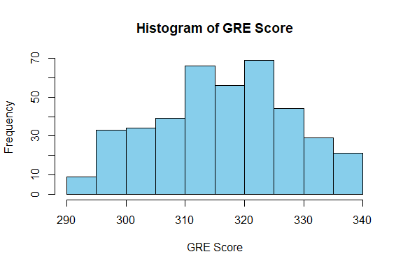
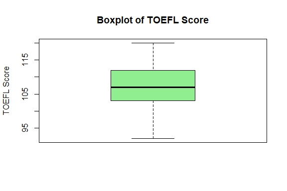
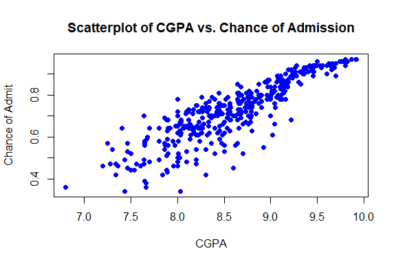
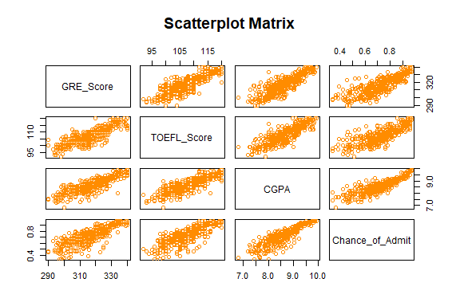

Graduate Admission Prediction
================
Trevor Okinda
2024

- [Student Details](#student-details)
- [Setup Chunk](#setup-chunk)
  - [Source:](#source)
  - [Reference:](#reference)
- [Exploratory Data Analysis](#exploratory-data-analysis)
  - [Load dataset](#load-dataset)
  - [Measures of Frequency](#measures-of-frequency)
  - [Measures of Central Tendency](#measures-of-central-tendency)
  - [Measures of Distribution](#measures-of-distribution)
  - [Measures of Relationship](#measures-of-relationship)
  - [ANOVA](#anova)
  - [Plots](#plots)
- [Preprocessing and Data
  Transformation](#preprocessing-and-data-transformation)
  - [Missing Values](#missing-values)
- [Training Models](#training-models)
  - [Data Splitting](#data-splitting)
  - [Bootstrapping](#bootstrapping)
  - [Cross-validation](#cross-validation)
  - [Training Different Models](#training-different-models)
  - [Performance Comparison](#performance-comparison)
  - [Saving Model](#saving-model)

# Student Details

|                       |                               |
|-----------------------|-------------------------------|
| **Student ID Number** | 134780                        |
| **Student Name**      | Trevor Okinda                 |
| **BBIT 4.2 Group**    | C                             |
| **Project Name**      | Graduate Admission Prediction |

# Setup Chunk

**Note:** the following KnitR options have been set as the global
defaults: <BR>
`knitr::opts_chunk$set(echo = TRUE, warning = FALSE, eval = TRUE, collapse = FALSE, tidy = TRUE)`.

More KnitR options are documented here
<https://bookdown.org/yihui/rmarkdown-cookbook/chunk-options.html> and
here <https://yihui.org/knitr/options/>.

### Source:

The dataset that was used can be downloaded here: *\<<a
href="https://www.kaggle.com/datasets/mohansacharya/graduate-admissions?select=Admission_Predict.csv\"
class="uri">https://www.kaggle.com/datasets/mohansacharya/graduate-admissions?select=Admission_Predict.csv\</a>\>*

### Reference:

*\<Acharya, M. S. (2018). Graduate Admission 2 Dataset. Retrieved from
Kaggle <a
href="https://www.kaggle.com/datasets/mohansacharya/graduate-admissions?select=Admission_Predict.csv\"
class="uri">https://www.kaggle.com/datasets/mohansacharya/graduate-admissions?select=Admission_Predict.csv\</a>\>  
Refer to the APA 7th edition manual for rules on how to cite datasets:
<https://apastyle.apa.org/style-grammar-guidelines/references/examples/data-set-references>*

# Exploratory Data Analysis

## Load dataset

``` r
# Load dataset
admission_data <- read.csv("Admission_Predict.csv", colClasses = c(
  GRE_Score = "numeric",
  TOEFL_Score = "numeric",
  University_Rating = "factor",
  SOP = "numeric",
  LOR = "numeric",
  CGPA = "numeric",
  Research = "factor",
  Chance_of_Admit = "numeric"
))

# Display the structure of the dataset
str(admission_data)
```

    ## 'data.frame':    400 obs. of  8 variables:
    ##  $ GRE_Score        : num  337 324 316 322 314 330 321 308 302 323 ...
    ##  $ TOEFL_Score      : num  118 107 104 110 103 115 109 101 102 108 ...
    ##  $ University_Rating: Factor w/ 5 levels "1","2","3","4",..: 4 4 3 3 2 5 3 2 1 3 ...
    ##  $ SOP              : num  4.5 4 3 3.5 2 4.5 3 3 2 3.5 ...
    ##  $ LOR              : num  4.5 4.5 3.5 2.5 3 3 4 4 1.5 3 ...
    ##  $ CGPA             : num  9.65 8.87 8 8.67 8.21 9.34 8.2 7.9 8 8.6 ...
    ##  $ Research         : Factor w/ 2 levels "0","1": 2 2 2 2 1 2 2 1 1 1 ...
    ##  $ Chance_of_Admit  : num  0.92 0.76 0.72 0.8 0.65 0.9 0.75 0.68 0.5 0.45 ...

``` r
# View the first few rows of the dataset
head(admission_data)
```

    ##   GRE_Score TOEFL_Score University_Rating SOP LOR CGPA Research Chance_of_Admit
    ## 1       337         118                 4 4.5 4.5 9.65        1            0.92
    ## 2       324         107                 4 4.0 4.5 8.87        1            0.76
    ## 3       316         104                 3 3.0 3.5 8.00        1            0.72
    ## 4       322         110                 3 3.5 2.5 8.67        1            0.80
    ## 5       314         103                 2 2.0 3.0 8.21        0            0.65
    ## 6       330         115                 5 4.5 3.0 9.34        1            0.90

``` r
# View the dataset in a separate viewer window
View(admission_data)
```

## Measures of Frequency

``` r
# Measures of Frequency
# Count of research experience
research_count <- table(admission_data$Research)
print("Frequency of Research Experience:")
```

    ## [1] "Frequency of Research Experience:"

``` r
print(research_count)
```

    ## 
    ##   0   1 
    ## 181 219

## Measures of Central Tendency

``` r
# Measures of Central Tendency
# Mean, Median, and Mode of GRE Score
gre_mean <- mean(admission_data$GRE_Score)
gre_median <- median(admission_data$GRE_Score)
gre_mode <- as.numeric(names(sort(table(admission_data$GRE_Score), decreasing = TRUE)[1]))
print("Measures of Central Tendency for GRE Score:")
```

    ## [1] "Measures of Central Tendency for GRE Score:"

``` r
print(paste("Mean:", gre_mean))
```

    ## [1] "Mean: 316.8075"

``` r
print(paste("Median:", gre_median))
```

    ## [1] "Median: 317"

``` r
print(paste("Mode:", gre_mode))
```

    ## [1] "Mode: 312"

## Measures of Distribution

``` r
# Measures of Distribution
# Range and Standard Deviation of CGPA
cgpa_range <- range(admission_data$CGPA)
cgpa_sd <- sd(admission_data$CGPA)
print("Measures of Distribution for CGPA:")
```

    ## [1] "Measures of Distribution for CGPA:"

``` r
print(paste("Range:", cgpa_range))
```

    ## [1] "Range: 6.8"  "Range: 9.92"

``` r
print(paste("Standard Deviation:", cgpa_sd))
```

    ## [1] "Standard Deviation: 0.596317096496432"

## Measures of Relationship

``` r
# Measures of Relationship
# Correlation between TOEFL Score and Chance of Admit
toefl_chance_cor <- cor(admission_data$TOEFL_Score, admission_data$Chance_of_Admit)
print("Correlation between TOEFL Score and Chance of Admit:")
```

    ## [1] "Correlation between TOEFL Score and Chance of Admit:"

``` r
print(toefl_chance_cor)
```

    ## [1] 0.791594

## ANOVA

``` r
# Perform ANOVA
# Considering University Rating as a factor variable
anova_result <- aov(Chance_of_Admit ~ University_Rating, data = admission_data)

# Summary of ANOVA results
summary(anova_result)
```

    ##                    Df Sum Sq Mean Sq F value Pr(>F)    
    ## University_Rating   4  4.125  1.0311   102.1 <2e-16 ***
    ## Residuals         395  3.990  0.0101                   
    ## ---
    ## Signif. codes:  0 '***' 0.001 '**' 0.01 '*' 0.05 '.' 0.1 ' ' 1

## Plots

``` r
# Univariate Plots
# Histogram of GRE Score
hist(admission_data$GRE_Score, main = "Histogram of GRE Score", xlab = "GRE Score", col = "skyblue", border = "black")
```

<!-- -->

``` r
# Boxplot of TOEFL Score
boxplot(admission_data$TOEFL_Score, main = "Boxplot of TOEFL Score", ylab = "TOEFL Score", col = "lightgreen", border = "black")
```

<!-- -->

``` r
# Multivariate Plots
# Scatterplot of CGPA vs. Chance of Admit
plot(admission_data$CGPA, admission_data$Chance_of_Admit, main = "Scatterplot of CGPA vs. Chance of Admission", xlab = "CGPA", ylab = "Chance of Admit", col = "blue", pch = 16)
```

<!-- -->

``` r
# Scatterplot Matrix for numeric variables
pairs(admission_data[, c("GRE_Score", "TOEFL_Score", "CGPA", "Chance_of_Admit")], main = "Scatterplot Matrix", col = "darkorange")
```

<!-- -->

# Preprocessing and Data Transformation

## Missing Values

``` r
# Load necessary library
library(dplyr)
```

    ## 
    ## Attaching package: 'dplyr'

    ## The following objects are masked from 'package:stats':
    ## 
    ##     filter, lag

    ## The following objects are masked from 'package:base':
    ## 
    ##     intersect, setdiff, setequal, union

``` r
# Check for missing values in the dataset
missing_values <- admission_data %>%
  summarise_all(funs(sum(is.na(.))))

# Display the summary of missing values
print("Summary of Missing Values:")
```

    ## [1] "Summary of Missing Values:"

``` r
print(missing_values)
```

    ##   GRE_Score TOEFL_Score University_Rating SOP LOR CGPA Research Chance_of_Admit
    ## 1         0           0                 0   0   0    0        0               0

# Training Models

## Data Splitting

``` r
# Load necessary library
library(caret)
```

    ## Loading required package: ggplot2

    ## Loading required package: lattice

``` r
# Set seed for reproducibility
set.seed(123)

# Split the data into training and testing sets (80% training, 20% testing)
trainIndex <- createDataPartition(admission_data$Chance_of_Admit, p = 0.8, list = FALSE)
train_data <- admission_data[trainIndex, ]
test_data <- admission_data[-trainIndex, ]

# Display the number of observations in each set
cat("Number of observations in training set:", nrow(train_data), "\n")
```

    ## Number of observations in training set: 322

``` r
cat("Number of observations in testing set:", nrow(test_data), "\n")
```

    ## Number of observations in testing set: 78

## Bootstrapping

``` r
# Load necessary library
library(boot)
```

    ## 
    ## Attaching package: 'boot'

    ## The following object is masked from 'package:lattice':
    ## 
    ##     melanoma

``` r
# Define a function to compute the statistic of interest (mean in this case)
boot_mean <- function(data, indices) {
  return(mean(data[indices]))
}

# Apply bootstrapping on the Chance_of_Admit column
set.seed(123)
bootstrap_results <- boot(data = train_data$Chance_of_Admit, statistic = boot_mean, R = 1000)

# Display the bootstrapping results
print(bootstrap_results)
```

    ## 
    ## ORDINARY NONPARAMETRIC BOOTSTRAP
    ## 
    ## 
    ## Call:
    ## boot(data = train_data$Chance_of_Admit, statistic = boot_mean, 
    ##     R = 1000)
    ## 
    ## 
    ## Bootstrap Statistics :
    ##      original       bias    std. error
    ## t1* 0.7259006 1.062112e-05 0.007742177

## Cross-validation

``` r
# Load necessary library
library(caret)

# Define the control using a basic cross-validation (10-fold)
ctrl <- trainControl(method = "cv", number = 10)

# Train a model using cross-validation (e.g., linear model)
set.seed(123)
cv_model <- train(Chance_of_Admit ~ ., data = train_data, method = "lm", trControl = ctrl)

# Display the cross-validation results
print(cv_model)
```

    ## Linear Regression 
    ## 
    ## 322 samples
    ##   7 predictor
    ## 
    ## No pre-processing
    ## Resampling: Cross-Validated (10 fold) 
    ## Summary of sample sizes: 290, 289, 289, 291, 290, 290, ... 
    ## Resampling results:
    ## 
    ##   RMSE        Rsquared   MAE       
    ##   0.06444345  0.7927323  0.04548822
    ## 
    ## Tuning parameter 'intercept' was held constant at a value of TRUE

## Training Different Models

``` r
# Load necessary libraries
library(caret)
library(rpart)
library(randomForest)
```

    ## randomForest 4.7-1.1

    ## Type rfNews() to see new features/changes/bug fixes.

    ## 
    ## Attaching package: 'randomForest'

    ## The following object is masked from 'package:ggplot2':
    ## 
    ##     margin

    ## The following object is masked from 'package:dplyr':
    ## 
    ##     combine

``` r
# Set seed for reproducibility
set.seed(123)

# Train a Linear Regression model
lm_model <- train(Chance_of_Admit ~ ., data = train_data, method = "lm")
print("Linear Regression Model:")
```

    ## [1] "Linear Regression Model:"

``` r
print(lm_model)
```

    ## Linear Regression 
    ## 
    ## 322 samples
    ##   7 predictor
    ## 
    ## No pre-processing
    ## Resampling: Bootstrapped (25 reps) 
    ## Summary of sample sizes: 322, 322, 322, 322, 322, 322, ... 
    ## Resampling results:
    ## 
    ##   RMSE        Rsquared   MAE       
    ##   0.06653772  0.7846964  0.04686117
    ## 
    ## Tuning parameter 'intercept' was held constant at a value of TRUE

``` r
# Train a Decision Tree model
dt_model <- train(Chance_of_Admit ~ ., data = train_data, method = "rpart")
print("Decision Tree Model:")
```

    ## [1] "Decision Tree Model:"

``` r
print(dt_model)
```

    ## CART 
    ## 
    ## 322 samples
    ##   7 predictor
    ## 
    ## No pre-processing
    ## Resampling: Bootstrapped (25 reps) 
    ## Summary of sample sizes: 322, 322, 322, 322, 322, 322, ... 
    ## Resampling results across tuning parameters:
    ## 
    ##   cp          RMSE        Rsquared   MAE       
    ##   0.08268967  0.08787340  0.6160318  0.06741895
    ##   0.11070106  0.09452028  0.5535975  0.07443244
    ##   0.52764943  0.10573589  0.4737231  0.08449099
    ## 
    ## RMSE was used to select the optimal model using the smallest value.
    ## The final value used for the model was cp = 0.08268967.

``` r
# Train a Random Forest model
rf_model <- train(Chance_of_Admit ~ ., data = train_data, method = "rf")
print("Random Forest Model:")
```

    ## [1] "Random Forest Model:"

``` r
print(rf_model)
```

    ## Random Forest 
    ## 
    ## 322 samples
    ##   7 predictor
    ## 
    ## No pre-processing
    ## Resampling: Bootstrapped (25 reps) 
    ## Summary of sample sizes: 322, 322, 322, 322, 322, 322, ... 
    ## Resampling results across tuning parameters:
    ## 
    ##   mtry  RMSE        Rsquared   MAE       
    ##    2    0.06580707  0.7859384  0.04660391
    ##    6    0.06702546  0.7760191  0.04761546
    ##   10    0.06990111  0.7583020  0.04977773
    ## 
    ## RMSE was used to select the optimal model using the smallest value.
    ## The final value used for the model was mtry = 2.

``` r
# Make predictions on the test set for each model
lm_predictions <- predict(lm_model, newdata = test_data)
dt_predictions <- predict(dt_model, newdata = test_data)
rf_predictions <- predict(rf_model, newdata = test_data)

# Evaluate model performance
lm_rmse <- sqrt(mean((lm_predictions - test_data$Chance_of_Admit)^2))
dt_rmse <- sqrt(mean((dt_predictions - test_data$Chance_of_Admit)^2))
rf_rmse <- sqrt(mean((rf_predictions - test_data$Chance_of_Admit)^2))

cat("RMSE for Linear Regression:", lm_rmse, "\n")
```

    ## RMSE for Linear Regression: 0.06612999

``` r
cat("RMSE for Decision Tree:", dt_rmse, "\n")
```

    ## RMSE for Decision Tree: 0.08553544

``` r
cat("RMSE for Random Forest:", rf_rmse, "\n")
```

    ## RMSE for Random Forest: 0.07202813

## Performance Comparison

``` r
# Collect resamples for model comparison
results <- resamples(list(
  Linear_Regression = lm_model,
  Decision_Tree = dt_model,
  Random_Forest = rf_model
))

# Summary of the resamples
summary(results)
```

    ## 
    ## Call:
    ## summary.resamples(object = results)
    ## 
    ## Models: Linear_Regression, Decision_Tree, Random_Forest 
    ## Number of resamples: 25 
    ## 
    ## MAE 
    ##                         Min.    1st Qu.     Median       Mean    3rd Qu.
    ## Linear_Regression 0.04239884 0.04467695 0.04716205 0.04686117 0.04829633
    ## Decision_Tree     0.05517147 0.06372683 0.06816929 0.06741895 0.07287226
    ## Random_Forest     0.04166721 0.04442188 0.04674888 0.04660391 0.04772481
    ##                         Max. NA's
    ## Linear_Regression 0.05293289    0
    ## Decision_Tree     0.07741627    0
    ## Random_Forest     0.05480548    0
    ## 
    ## RMSE 
    ##                         Min.    1st Qu.     Median       Mean    3rd Qu.
    ## Linear_Regression 0.05860821 0.06291918 0.06629450 0.06653772 0.06919689
    ## Decision_Tree     0.07409643 0.08328679 0.08889539 0.08787340 0.09336305
    ## Random_Forest     0.05778882 0.06318227 0.06571436 0.06580707 0.06764832
    ##                         Max. NA's
    ## Linear_Regression 0.07632980    0
    ## Decision_Tree     0.09896986    0
    ## Random_Forest     0.07706000    0
    ## 
    ## Rsquared 
    ##                        Min.   1st Qu.    Median      Mean   3rd Qu.      Max.
    ## Linear_Regression 0.7226156 0.7726770 0.7840412 0.7846964 0.7953565 0.8363130
    ## Decision_Tree     0.5216497 0.5680202 0.6114646 0.6160318 0.6561883 0.7141988
    ## Random_Forest     0.7126500 0.7724022 0.7914424 0.7859384 0.7986809 0.8212156
    ##                   NA's
    ## Linear_Regression    0
    ## Decision_Tree        0
    ## Random_Forest        0

``` r
# Boxplots of the resamples
bwplot(results, main = "Model Performance Comparison")
```

<!-- -->

``` r
# Dot plots of the resamples
dotplot(results, main = "Model Performance Comparison")
```

<!-- -->

## Saving Model

``` r
# Load the saved linear regression model
loaded_linear_regression_model <- readRDS("./models/linear_regression_model.rds")

# Prepare new data for prediction (example data similar to the admission dataset structure)
new_data <- data.frame(
  GRE_Score = c(330, 320, 310),  # Example GRE_Score values
  TOEFL_Score = c(115, 110, 105),  # Example TOEFL_Score values
  University_Rating = factor(c(5, 4, 3), levels = c(1, 2, 3, 4, 5)),  # Example University_Rating values
  SOP = c(4.5, 4.0, 3.5),  # Example SOP values
  LOR = c(4.5, 4.0, 3.5),  # Example LOR values
  CGPA = c(9.5, 8.5, 7.5),  # Example CGPA values
  Research = factor(c(1, 0, 1), levels = c(0, 1))  # Example Research values
)

# Use the loaded model to make predictions for new data
predictions_loaded_model <- predict(loaded_linear_regression_model, newdata = new_data)

# Print predictions
print(predictions_loaded_model)
```

    ##         1         2         3 
    ## 0.9231792 0.7214254 0.5921647
